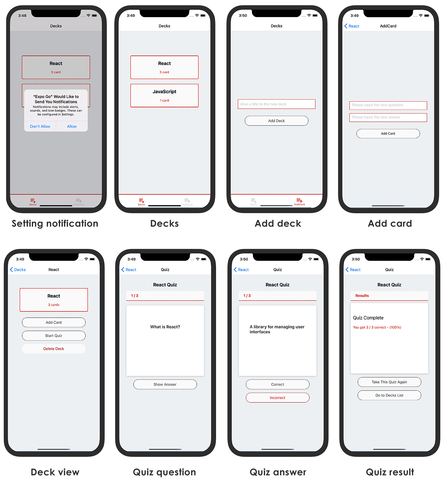

# 📱 FlashCards App
<p>
  <!-- iOS -->
  
  <!-- Android -->
  
  <!-- Web -->
  
</p>

## 📷 App Screens


## 📄 Description
This is the 3rd and final project required for the [Udacity's React Nanodegree program](https://www.udacity.com/course/react-nanodegree--nd019). It's a React Native app so the same codebase is used to create packages for both Androids and iOS and I've use Redux to keep data. The app has been tested on Expo Snack Workspace.


## 🎯 How play with it
FlashCards is an app that helps you to study. For each subject or category you are studying, you can create a deck. Each deck (category) will contain questions (cards) you want to asnwer. For each card you create a question and an answer.

Once you have a deck with cards, you can start a quiz to test your knowledge. As you go through the quiz, you will see the question, you can think about your answer, then you can see the answer flipping the card and you will mark the card as "Correct" or "Incorrect" depending on whether the answer you thought was the right one or not. At the end of your quiz you will get a score.


## 🎓 Made with
- React Native
- Redux
- Expo

## ✨ Live demo
 [FlashCards App on Expo Snack Workspace](https://snack.expo.io/@soulfood/flashcards-app)


## 🚀 How download and test it
1. You need to have Node.js, npm and yarn installed
2. Proceed by cloning or downloading the project as a zip
3. Extract and change directory to the project folder
4. Open your Terminal or Command prompt and type ```yarn install```
5. Then type ```yarn start```
6. This will open Expo Developer Tools in the browser.  You can then do one of the following.
- Use your device to test:
    Scan the QR Code using the Expo Client app ([Expo Client for Android & iOS](https://expo.io/tools#client))  from an Android or iOS device.
- Use an Android Emulator or iOS Simulator to run the app:
    - [iOS Simulator Setup](https://docs.expo.io/versions/v33.0.0/introduction/installation/#ios-simulator)
    - [Android Emulator Setup](https://docs.expo.io/versions/v33.0.0/introduction/installation/#android-emulator)


## 📝 Notes
This project was created starting with [Create React Native App](https://github.com/react-community/create-react-native-app).
